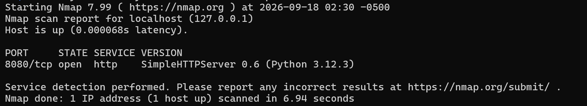
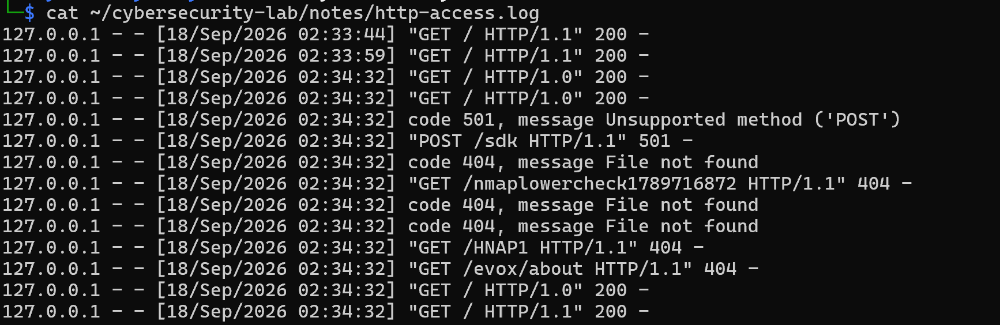

# Home Cybersecurity Lab

This is a cybersecurity home lab I built to get hands-on experience with Linux, networking, Nmap, service detection, and log analysis.

## Lab Setup

- Windows 11 ARM64 host
- Kali Linux through WSL
- Ubuntu 24.04 through WSL
- Nmap
- Python HTTP server

## What I Did

For the first part of this project, I learned how to use Nmap to scan ports and identify running services.

I first scanned my Kali environment to create a baseline. I then started a Python HTTP server and saw how the port changed from closed to open.

I also created a test HTTP service using Ubuntu and used Kali to identify the service running on port 8080.

After scanning the service, I looked at the HTTP server logs and noticed that Nmap generated multiple requests while trying to identify the service.

## What I Learned

- Basic Linux commands
- IP addresses and network interfaces
- Default gateways and routing
- Open vs. closed ports
- Nmap port scanning
- Nmap service detection
- Basic HTTP requests
- HTTP status codes
- Basic server log analysis

## Project Files

- `scans/` - Saved Nmap scan results
- `notes/` - Networking information and HTTP logs
- `reports/` - My lab analysis
- `screenshots/` - Screenshots from the lab

## Screenshots

### Nmap Service Detection

This scan shows Nmap identifying the HTTP service running on port 8080.

### HTTP Log Analysis

The server logs show a normal HTTP request along with requests generated during Nmap service detection.

## Next Steps

I plan to continue expanding this lab with network traffic analysis and additional defensive security exercises.
